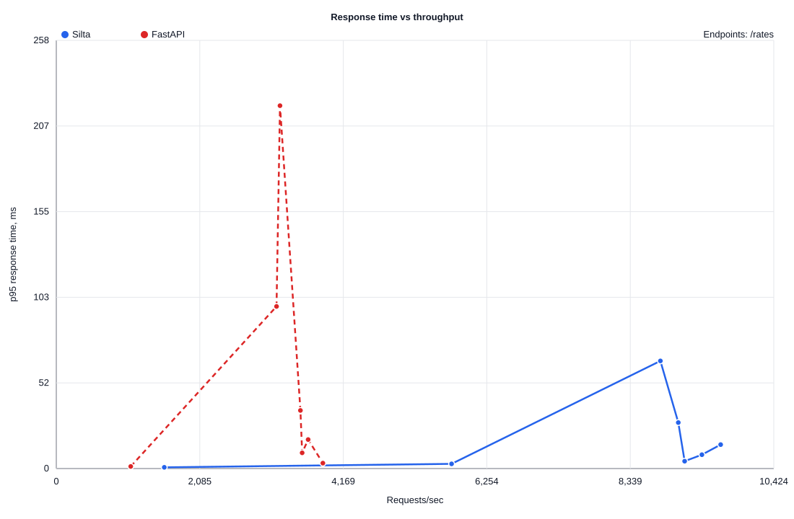

# Silta

> Write Python. Run Rust.

Silta is a runtime-first backend framework for Python developers, powered by a
native Rust execution engine.

`silta` means `bridge` in Finnish. That is the project idea: keep the Python
developer experience on the outside, and move the hot infrastructure path into
Rust.

```text
Python developer experience
        |
      Silta
        |
Rust native runtime
```

[Website](https://silta.dev) | [Documentation](docs/README.md) | [Architecture](ARCHITECTURE.md) | [RFCs](rfcs/README.md) | [Experiments](experiments/README.md) | [Funding](FUNDING.md) | [License](LICENSING.md)

## What Silta Is

Silta is not a FastAPI wrapper and not an ASGI server.

The goal is to let Python developers define backends naturally while the runtime
executes common infrastructure work natively:

```text
HTTP request
  -> Rust HTTP server
  -> Rust router
  -> Rust validation
  -> Rust database/query adapter
  -> Rust serialization
  -> JSON response
```

Python remains the control plane. Rust is the execution plane.

## Why It Exists

Python is great for backend development speed.

Rust is great for predictable high-concurrency execution.

Silta bridges them without forcing every Python developer to learn Cargo,
compile Rust, or rewrite their application in Rust.

## Target Install

```bash
pip install silta
```

Silta should not require ordinary Python users to install Rust or run Cargo.
Native Rust runtime artifacts should be distributed through Python wheels.

Current prototype:

```bash
silta inspect examples/hello-world/app.py:app
silta dev examples/hello-world/app.py:app
```

prints the application definition metadata. `silta dev` can start the first
native Rust runtime prototype when the `silta-runtime` binary is available.

## Python Shape

Subject to RFC.

```python
from silta import App, Model

app = App()


class User(Model):
    id: int
    name: str
    email: str


app.crud(User)
```

Potential generated endpoints:

```text
GET     /users
GET     /users/{id}
POST    /users
PATCH   /users/{id}
DELETE  /users/{id}
```

## Benchmark Snapshot

POC-001 compares the Silta native Rust runtime against FastAPI on the same local
PostgreSQL container after benchmark tuning.



Best local points from the current prototype:

| Endpoint | Silta | FastAPI | Signal |
| --- | ---: | ---: | --- |
| `/ping` | 133,413 RPS | 48,662 RPS | Lower HTTP/runtime overhead |
| `/rates/EUR/USD` | 15,753 RPS | 11,958 RPS | Native DB path leads after tuning |
| `/rates` | 9,652 RPS | 3,873 RPS | Larger JSON response favors Rust serialization |

See the full report in
[experiments/poc-001-pip-native-runtime/reports/load-curve-postgres-tuned](experiments/poc-001-pip-native-runtime/reports/load-curve-postgres-tuned/README.md).

These are local prototype measurements, not a production performance claim.

## Current Status

Silta is in Technical Preview.

The API is not stable yet.

The architecture is being validated through prototypes and benchmarks. The
first native runtime prototype serves HTTP, JSON, and PostgreSQL-backed routes
from Rust modules configured through the Python CLI.

Silta does not yet provide a production server, Python execution bridge, ORM,
deployment system, authentication, GraphQL, or gRPC support.

## Beta Milestone

Silta should move from Technical Preview to Beta when these criteria are met:

- `pip install silta` installs a wheel with the native runtime artifact.
- The Python route API is stable enough for early users.
- Native PostgreSQL CRUD works from Python model definitions.
- Runtime configuration is documented for local and container deployments.
- Benchmark runs are reproducible in CI and locally.
- The project has a small example application that can be cloned, run, and
  modified without Rust knowledge.

## Architecture Documents

- [ARCHITECTURE.md](ARCHITECTURE.md): system boundaries.
- [docs/architecture/overview.md](docs/architecture/overview.md): Python
  control plane and Rust execution plane.
- [docs/architecture/runtime.md](docs/architecture/runtime.md): runtime
  ownership.
- [docs/architecture/database-adapters.md](docs/architecture/database-adapters.md):
  SQLx, tokio-postgres, Diesel, and Kafka adapter direction.

## Project Origin

Silta was originally conceived and initiated by Serge Gnezdilov.

See [AUTHORS.md](AUTHORS.md), [NOTICE](NOTICE), and
[LICENSING.md](LICENSING.md).

## License

Licensed under:

- Apache License 2.0
