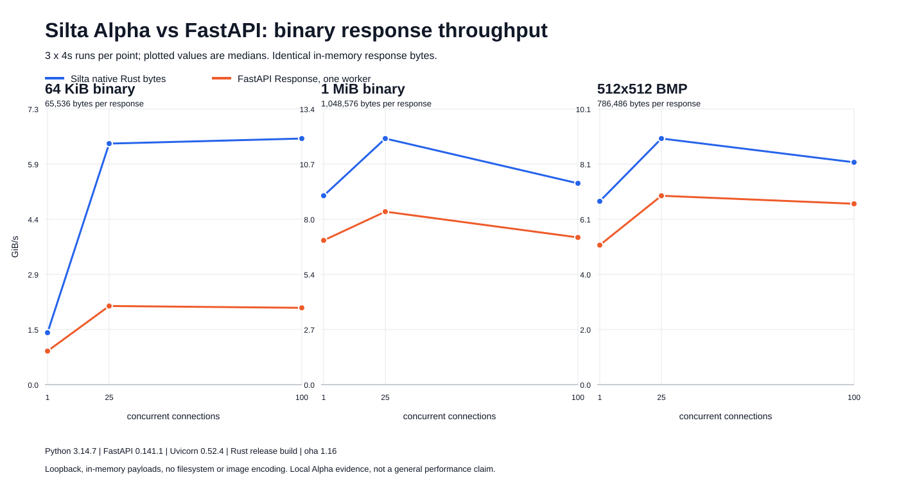

# Binary response benchmark results

3 x 4s runs per point; plotted values are medians.

This run compares the Silta native Rust response path with a single optimized
FastAPI/Uvicorn worker. Both servers return the same payload object created once
at startup. Before load generation, the runner verifies the MIME type, exact
body size, byte equality, and BMP structure.

## Environment

- Host: Apple M5, 10 logical CPUs, 24 GiB RAM.
- OS: macOS 26.6.2, Darwin arm64.
- Python: 3.14.7.
- Rust: rustc 1.98.0, cargo 1.98.0, release build.
- FastAPI: 0.141.1.
- Uvicorn: 0.52.4 with uvloop and httptools.
- Load generator: oha 1.16.0 over loopback.
- Duration: 4 seconds per sample.
- Repetitions: 3 per point; values below are medians.
- Concurrency: 1, 25, and 100 connections.

## Results

| Payload | Silta peak | FastAPI peak | Ratio | Silta p99 at peak | FastAPI p99 at peak |
| --- | ---: | ---: | ---: | ---: | ---: |
| 64 KiB binary | 6.56 GiB/s | 2.09 GiB/s | 3.13x | 2.7 ms | 1.6 ms |
| 1 MiB binary | 11.98 GiB/s | 8.42 GiB/s | 1.42x | 8.1 ms | 6.6 ms |
| 512x512 BMP | 9.02 GiB/s | 6.92 GiB/s | 1.30x | 11.2 ms | 5.9 ms |

All 54 samples completed with a 100% HTTP success rate. Raw `oha` JSON for every
sample is available in [`raw`](raw/), with parsed points in
[`load-curve.csv`](load-curve.csv) and medians in [`medians.csv`](medians.csv).

## Interpretation

The local result shows a clear native-path advantage for 64 KiB responses and a
smaller advantage once transfer bandwidth dominates for the 768 KiB and 1 MiB
payloads. Tail latency must be read separately: at each server's peak-throughput
point, Silta's p99 is higher for the two large payloads.

This benchmark isolates serving immutable in-memory bytes. It does not measure
filesystem reads, range requests, sendfile, compression, TLS, CDN behavior, or
per-request image encoding. It is an Alpha engineering result from one local
machine, not a general performance claim.
