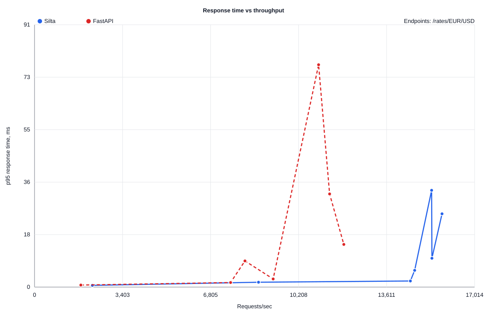
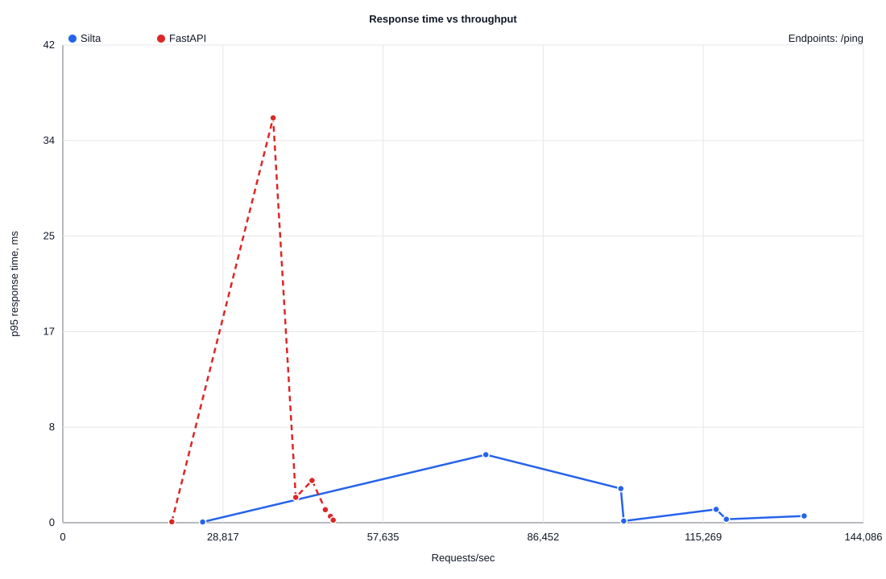

# POC-001 Load Curve: Tuned PostgreSQL

This report records a local POC snapshot comparing Silta's native Rust runtime
against FastAPI on the same local PostgreSQL container after benchmark tuning.
It is engineering evidence for the current prototype, not a production
performance claim.

## Environment

- PostgreSQL container: private local container used before the reproducible
  compose seed existed.
- PostgreSQL `max_connections`: `200`.
- PostgreSQL `shared_buffers`: `512MB`.
- PostgreSQL `wal_buffers`: `16MB`.
- PostgreSQL `random_page_cost`: `1.1`.
- Silta runtime: release build.
- Silta database pool: `SILTA_DB_MAX_CONNECTIONS=50`.
- FastAPI database pool: `FASTAPI_DB_MAX_CONNECTIONS=50`.
- Benchmark tool: `oha 1.16.0`.
- Requests per point: `5000`.
- Runs per point: `1`.
- Concurrency sweep: `1,10,25,50,100,200,400`.

Known gaps:

- The report does not yet record CPU model, OS version, Rust dependency
  versions, Python dependency versions, RSS, CPU usage, startup time, or
  allocation profiles.
- The run used a private local container and existing `public.rates` data. The
  experiment now includes a reproducible Docker Compose seed for future runs.
- The FastAPI baseline is a typical asyncpg/uvicorn comparison, not the most
  optimized possible FastAPI/orjson/multi-worker setup.
- Silta and FastAPI success responses are semantically close but not yet
  byte-identical. Error contracts are not aligned yet.
- The Rust -> Python -> Rust boundary path is not measured yet.

## Charts

### Larger JSON Response

### Single Row PostgreSQL Response

### HTTP Runtime Overhead

## Raw Data

[load-curve.csv](load-curve.csv) contains the raw points used by the charts.

## Key Points

| Endpoint | Silta Best RPS | FastAPI Best RPS | Main Finding |
| --- | ---: | ---: | --- |
| `/ping` | 133,413 | 48,662 | Silta has much lower HTTP/runtime overhead. |
| `/rates/EUR/USD` | 15,753 | 11,958 | Silta leads after PostgreSQL tuning; FastAPI p95 grows faster at high concurrency. |
| `/rates` | 9,652 | 3,873 | Silta is materially faster for larger JSON responses. |

The important signal is the load-curve shape: at higher concurrency, FastAPI
response times rise faster on the larger database-backed JSON endpoint in this
local setup. Before this becomes a public claim, the benchmark must be rerun as
30-second duration-based tests, three times per point, with full environment and
resource metrics.
