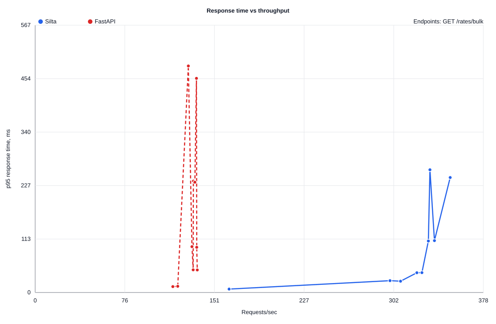

# POC-001 Big JSON Alpha Load Curve: Python 3.14

This report records a fresh local alpha smoke/load-curve run for a large JSON
read endpoint. It compares the current Silta Pre-Alpha native Rust runtime with
a FastAPI baseline on the same tuned local PostgreSQL container.

The endpoint returns 3,000 rows from PostgreSQL as nested JSON:

```text
GET /rates/bulk
```

The query reads from `public.rates`, joins `public.silta_rate_sources`, shapes
each record into nested API objects, and serializes the response to JSON. The
Silta path uses native Rust structs and Serde serialization. The FastAPI path
uses asyncpg rows, Python dictionaries, and the default FastAPI JSON response
path.

This is alpha-version engineering evidence, not a production performance
claim.

## Environment

- OS: macOS Darwin 25.6.0 arm64.
- CPU: Apple M5, 10 logical CPUs.
- RAM: 24 GiB.
- Python: 3.14.7.
- Rust: rustc 1.98.0, cargo 1.98.0.
- Silta runtime: release build.
- FastAPI: 0.141.1.
- Uvicorn: 0.52.4 with uvloop and httptools.
- asyncpg: 0.31.0.
- Benchmark tool: oha 1.16.0.
- PostgreSQL: 16.15.
- PostgreSQL container: `silta-poc-postgres`.
- PostgreSQL `max_connections`: `200`.
- PostgreSQL `shared_buffers`: `512MB`.
- PostgreSQL `effective_cache_size`: `2GB`.
- `public.rates`: 250,000 seeded rows.
- `public.silta_rate_sources`: 1 seeded source metadata row.
- Response rows per request: 3,000.
- Silta response size: about 803 KB.
- FastAPI response size: about 812 KB.
- Silta database pool: `SILTA_DB_MAX_CONNECTIONS=80`.
- FastAPI database pool: `FASTAPI_DB_MAX_CONNECTIONS=80`.
- Duration per point: `5s`.
- Runs per point: `2`.
- Concurrency sweep: `1,5,10,25,50`.

## Chart

The chart plots averaged points per concurrency level. Raw per-run points stay
available in CSV and `oha` JSON files.



## Raw Data

- [load-curve.csv](load-curve.csv) contains parsed points.
- [raw](raw/) contains the raw `oha` JSON output for every point.

## Average Points

| Concurrency | Silta Avg RPS | Silta Avg p95 | FastAPI Avg RPS | FastAPI Avg p95 |
| ---: | ---: | ---: | ---: | ---: |
| 1 | 163 | 7.13 ms | 118 | 12.80 ms |
| 5 | 303 | 24.55 ms | 135 | 47.99 ms |
| 10 | 324 | 42.00 ms | 134 | 96.62 ms |
| 25 | 334 | 109.67 ms | 134 | 235.27 ms |
| 50 | 341 | 252.22 ms | 132 | 467.60 ms |

## Best Local Point

| Endpoint | Silta Best RPS | Silta p95 | FastAPI Best RPS | FastAPI p95 | Signal |
| --- | ---: | ---: | ---: | ---: | --- |
| `GET /rates/bulk` | 350 | 244.02 ms | 137 | 47.81 ms | Silta moves more large JSON responses per second; p95 must be read from the load curve, not the best RPS row alone. |

## Caveats

- This is a short alpha smoke run, not the final benchmark gate.
- The final benchmark gate should use 30-second points, at least three runs,
  CPU/RSS/startup/allocation tracking, and a fully documented dependency lock.
- Response bytes are close but not identical because timestamp formatting still
  differs.
- FastAPI is measured as a typical asyncpg/uvicorn baseline, not an optimized
  orjson/multi-worker baseline.
- Rust -> Python -> Rust boundary cost is not measured yet.
