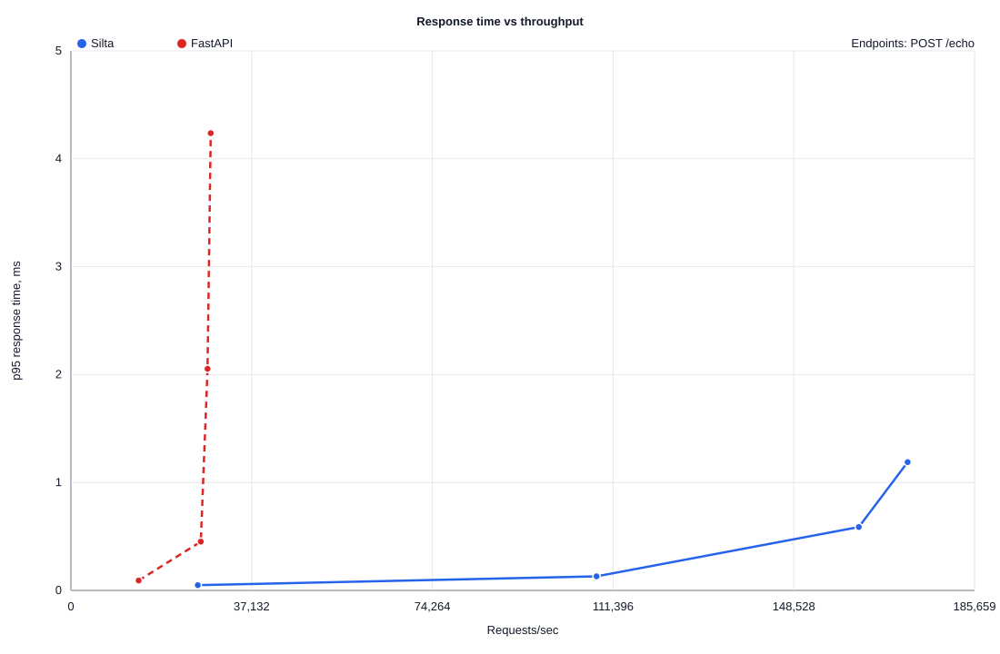
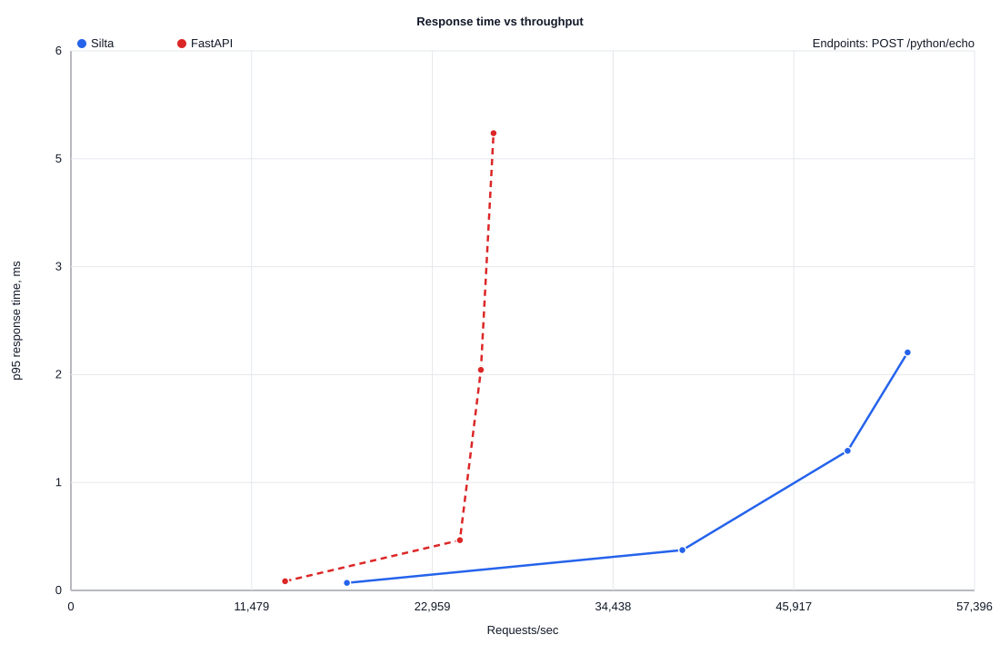
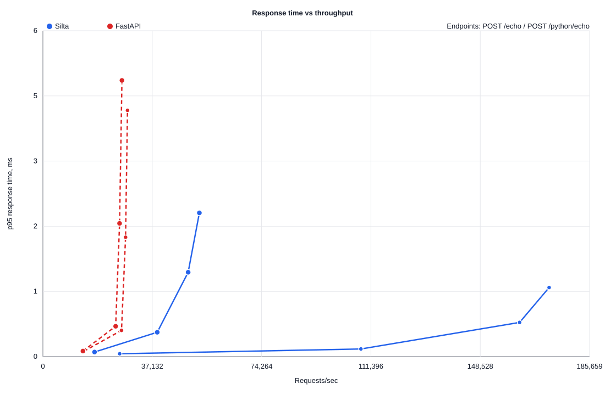

# POC-001 Rust-Python-Rust Bridge Alpha Load Curve: Python 3.14

This report records the first local alpha smoke/load-curve run for the Silta
Rust -> Python -> Rust execution path.

The bridge route is declared in Python:

```python
@app.post("/python/echo", python=True)
def python_echo(request):
    return {"bridge": "python", "payload": request["body"]}
```

The Rust runtime starts the HTTP server, receives the request, sends a JSON
message to a Python worker process, reads the JSON response back, and serializes
the HTTP response from Rust.

This prototype uses a single JSON-lines subprocess worker. It is intentionally
small and measurable; it is not the final Python bridge design. Future bridge
experiments should compare this with PyO3 and a worker-pool design.

This is alpha-version engineering evidence, not a production performance
claim.

## Environment

- OS: macOS Darwin 25.6.0 arm64.
- CPU: Apple M5, 10 logical CPUs.
- RAM: 24 GiB.
- Python: 3.14.7.
- Rust: rustc 1.98.0, cargo 1.98.0.
- Silta runtime: release build.
- FastAPI: 0.141.1.
- Uvicorn: 0.52.4 with uvloop and httptools.
- asyncpg: 0.31.0.
- Benchmark tool: oha 1.16.0.
- Duration per point: `5s`.
- Runs per point: `2`.
- Concurrency sweep: `1,10,50,100`.

## Charts

Charts plot averaged points per concurrency level. Raw per-run points stay
available in CSV and `oha` JSON files.

### Native Rust Echo



### Rust-Python-Rust Bridge Echo



### Combined



## Raw Data

- [load-curve.csv](load-curve.csv) contains parsed points.
- [raw](raw/) contains the raw `oha` JSON output for every point.

## Average Points

| Endpoint | Concurrency | Silta Avg RPS | Silta Avg p95 | FastAPI Avg RPS | FastAPI Avg p95 |
| --- | ---: | ---: | ---: | ---: | ---: |
| `/echo` | 1 | 26,071 | 0.05 ms | 13,906 | 0.09 ms |
| `/echo` | 10 | 108,003 | 0.13 ms | 26,693 | 0.45 ms |
| `/echo` | 50 | 161,881 | 0.59 ms | 28,081 | 2.06 ms |
| `/echo` | 100 | 171,907 | 1.19 ms | 28,726 | 4.26 ms |
| `/python/echo` | 1 | 17,532 | 0.08 ms | 13,606 | 0.10 ms |
| `/python/echo` | 10 | 38,837 | 0.42 ms | 24,707 | 0.53 ms |
| `/python/echo` | 50 | 49,333 | 1.46 ms | 26,042 | 2.30 ms |
| `/python/echo` | 100 | 53,145 | 2.49 ms | 26,842 | 4.78 ms |

## Best Local Points

| Path | Silta Best RPS | Silta p95 | FastAPI Best RPS | FastAPI p95 | Signal |
| --- | ---: | ---: | ---: | ---: | --- |
| Native Rust `/echo` | 172,667 | 1.23 ms | 28,758 | 4.24 ms | Native Rust request/JSON path has much lower overhead in this run. |
| Bridge `/python/echo` | 53,758 | 2.36 ms | 27,748 | 4.64 ms | First Rust -> Python -> Rust bridge path is measurable and still above this FastAPI baseline for small JSON. |

## Caveats

- This is a short alpha smoke run, not the final benchmark gate.
- The bridge is a single subprocess worker with a JSON-lines protocol.
- The bridge does not yet pass headers, query params, typed path params, or
  structured errors.
- FastAPI is measured as a typical uvicorn baseline, not a multi-worker tuned
  deployment.
- Future bridge designs must compare subprocess, PyO3, and worker-pool costs.
