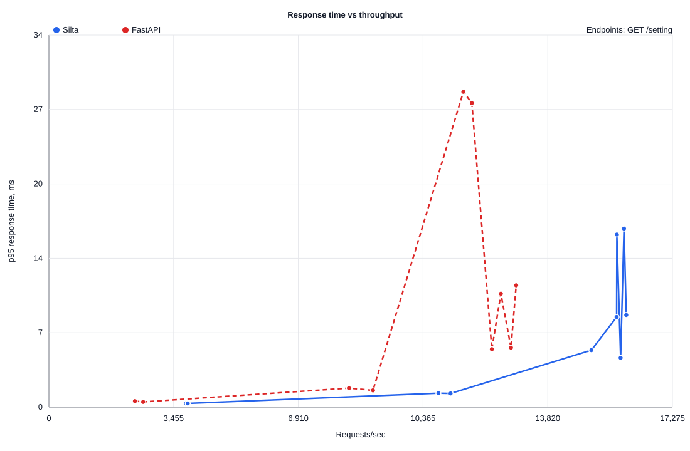
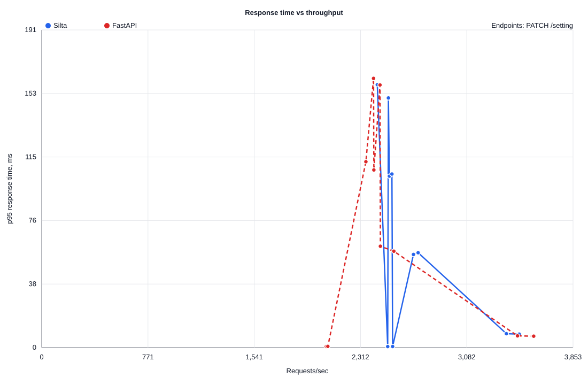
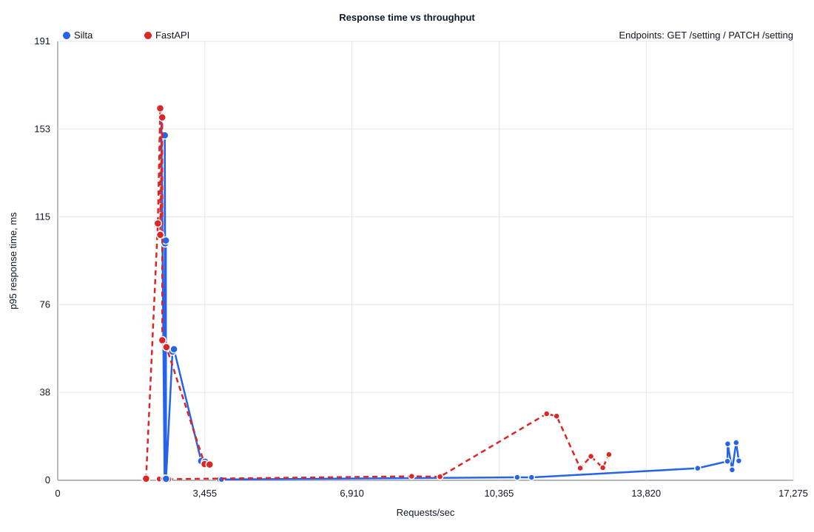

# POC-001 One-Row Alpha Load Curve: Python 3.14

This report records a fresh local alpha smoke/load-curve run on Python 3.14.
It compares the current Silta Pre-Alpha native Rust runtime with a FastAPI
baseline on the same tuned local PostgreSQL container.

The API intentionally uses one tiny PostgreSQL table with one row:

```text
GET   /setting
PATCH /setting
```

`GET /setting` is meant to reduce PostgreSQL as a bottleneck and expose the
runtime, pool, query, and serialization path. `PATCH /setting` intentionally
updates the same row, so it includes PostgreSQL row locking and WAL pressure.
That makes it useful as a write-path smoke test, not as a pure framework
overhead benchmark.

This is alpha-version engineering evidence, not a production performance
claim.

## Environment

- OS: macOS Darwin 25.6.0 arm64.
- CPU: Apple M5, 10 logical CPUs.
- RAM: 24 GiB.
- Python: 3.14.7.
- Rust: rustc 1.98.0, cargo 1.98.0.
- Silta runtime: release build.
- FastAPI: 0.141.1.
- Uvicorn: 0.52.4 with uvloop and httptools.
- asyncpg: 0.31.0.
- Benchmark tool: oha 1.16.0.
- PostgreSQL: 16.15.
- PostgreSQL container: `silta-poc-postgres`.
- PostgreSQL `max_connections`: `200`.
- PostgreSQL `shared_buffers`: `512MB`.
- PostgreSQL `effective_cache_size`: `2GB`.
- `public.silta_settings`: 1 seeded row.
- Silta database pool: `SILTA_DB_MAX_CONNECTIONS=80`.
- FastAPI database pool: `FASTAPI_DB_MAX_CONNECTIONS=80`.
- Duration per point: `5s`.
- Runs per point: `2`.
- Concurrency sweep: `1,10,50,100,200`.

## Charts

Charts plot averaged points per concurrency level. Raw per-run points stay
available in CSV and `oha` JSON files.

### One-Row Read



### One-Row Patch



### Combined



## Raw Data

- [load-curve.csv](load-curve.csv) contains parsed points.
- [raw](raw/) contains the raw `oha` JSON output for every point.

## Best Local Points

| Method | Endpoint | Silta Best RPS | Silta p95 | FastAPI Best RPS | FastAPI p95 | Signal |
| --- | --- | ---: | ---: | ---: | ---: | --- |
| GET | `/setting` | 15,995 | 8.46 ms | 12,946 | 11.19 ms | Silta leads on the one-row read path in this run. |
| PATCH | `/setting` | 3,463 | 8.07 ms | 3,568 | 6.86 ms | Same-row writes are dominated by PostgreSQL update serialization. |

## Caveats

- This is a short alpha smoke run, not the final benchmark gate.
- The final benchmark gate should use 30-second points, at least three runs,
  CPU/RSS/startup/allocation tracking, and a fully documented dependency lock.
- `PATCH /setting` updates one row by design, so PostgreSQL row locking is part
  of the measured path.
- FastAPI is measured as a typical asyncpg/uvicorn baseline, not an optimized
  orjson/multi-worker baseline.
- Rust -> Python -> Rust boundary cost is not measured yet.
