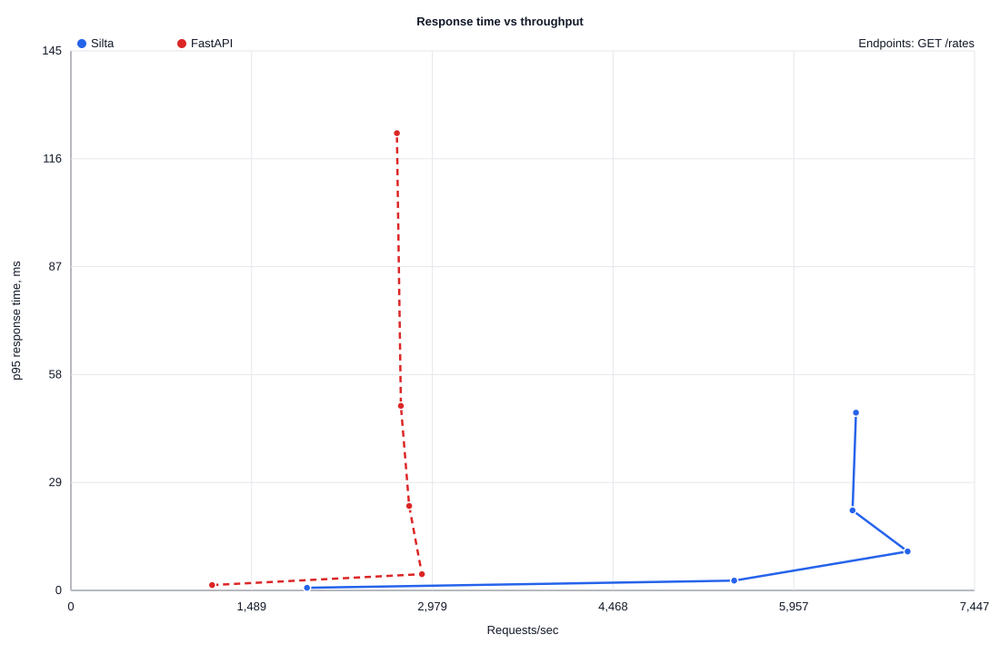
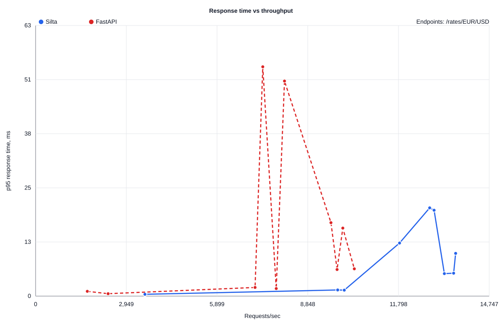
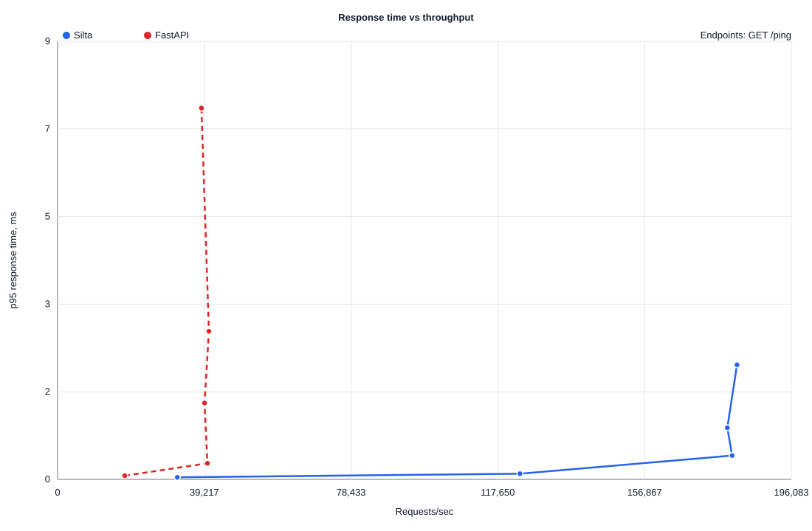

# POC-001 Load Curve: Python 3.14 Smoke

This report records a fresh local smoke/load-curve run on Python 3.14. It uses
the reproducible POC PostgreSQL container and the current Silta Pre-Alpha
runtime.

This is engineering evidence, not a production performance claim. The run uses
short 5-second points and two runs per point so it can be repeated quickly on a
developer machine.

## Environment

- OS: macOS Darwin 25.6.0 arm64.
- CPU: Apple M5, 10 logical CPUs.
- RAM: 24 GiB.
- Python: 3.14.7.
- Rust: rustc 1.98.0, cargo 1.98.0.
- Silta runtime: release build.
- FastAPI: 0.141.1.
- Uvicorn: 0.52.4 with uvloop and httptools.
- asyncpg: 0.31.0.
- Benchmark tool: oha 1.16.0.
- PostgreSQL: 16.15.
- PostgreSQL container: `silta-poc-postgres`.
- PostgreSQL `max_connections`: `200`.
- PostgreSQL `shared_buffers`: `512MB`.
- `public.rates`: 250,000 seeded rows.
- Silta database pool: `SILTA_DB_MAX_CONNECTIONS=50`.
- FastAPI database pool: `FASTAPI_DB_MAX_CONNECTIONS=50`.
- Duration per point: `5s`.
- Runs per point: `2`.
- Concurrency sweep: `1,10,50,100,200`.

## Charts

Charts plot averaged points per concurrency level. Raw per-run points stay
available in CSV and `oha` JSON files.

### Larger JSON Response

### Single Row PostgreSQL Response

### HTTP Runtime Overhead

## Raw Data

- [load-curve.csv](load-curve.csv) contains parsed points.
- [raw](raw/) contains the raw `oha` JSON output for every point.

## Best Local Points

| Endpoint | Silta Best RPS | FastAPI Best RPS | Signal |
| --- | ---: | ---: | --- |
| `/ping` | 182,345 | 40,878 | Native HTTP/runtime overhead is much lower. |
| `/rates/EUR/USD` | 13,655 | 10,362 | Silta leads on the single-row PostgreSQL path in this run. |
| `/rates` | 7,023 | 2,899 | Larger JSON response favors Rust serialization in this run. |

## Caveats

- This is a short smoke run, not the final 30-second three-run benchmark gate.
- Silta and FastAPI timestamp formatting still differs.
- FastAPI is measured as a typical asyncpg/uvicorn baseline, not an optimized
  orjson/multi-worker baseline.
- Rust -> Python -> Rust boundary cost is not measured yet.
